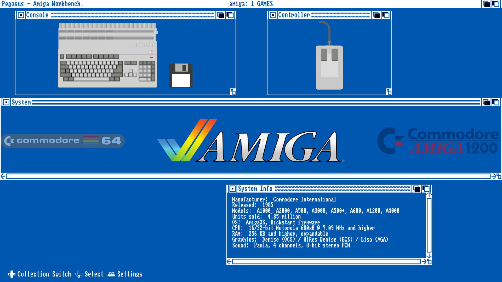
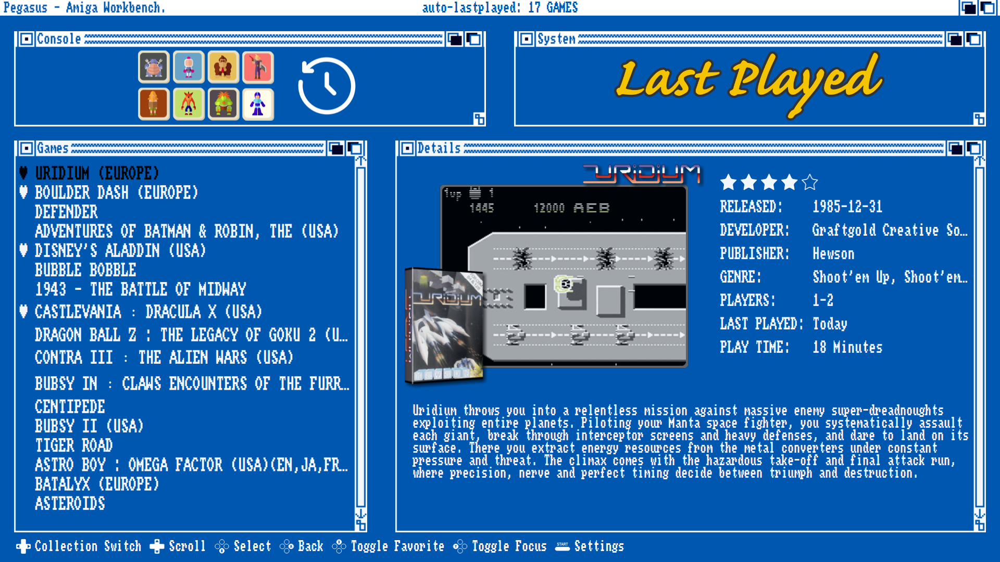

# Amiga Workbench theme for Pegasus

* Features: Favorites, Last Played, scrollable game description.
* Based on the [Amiga Workbench EmulationStation Theme](https://github.com/ehettervik/es-theme-workbench) as discussed on the [retropie forum](https://retropie.org.uk/forum/topic/5552/release-amiga-workbench-emulationstation-theme) back in 2016.
* The underlying art and mechanics are from the [Slatest](https://github.com/LeeBigelow/pegasus-theme-slatest) theme and all it's sources and contributors.
* Game mixed image screenshots generated by [Skyscraper](https://github.com/Gemba/skyscraper/tree/master)
* Theme testing *dummy roms* and all-in-one `metadata.pegasus.txt`: [Pegasus Dummy Roms](https://github.com/LeeBigelow/pegasus-frontend-dummy-roms)

## Installation

[Download](https://github.com/LeeBigelow/pegasus-theme-amiga-workbench/archive/master.zip) and extract to your [theme directory](http://pegasus-frontend.org/docs/user-guide/installing-themes). You can then select the theme in the settings menu of Pegasus.

## License

